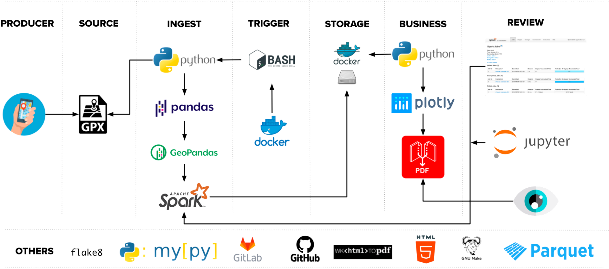

# workshops-data-glance-through-docker
Offer a first approach to the data world by using technologies that have a huge impact in the industry. Docker and PySpark.

The repo works around a Docker Image that supports two different components, one for running a Jupyter notebook server integrated with Pyspark and the other to represent a data pipeline from end to end to extract, transform and load a dataset based on a track of geopositions.

# Jupyter Component
This component is designed to run a Jupyter Server that communicates with Apache Spark in its Python variation (`PySpark`) which enables to work with distributed computional power using the Jupyter notebooks as interface to do so.

The specific files required by this component are:
#### ``docker/jupyter_notebook_config.py``
This Python script set the necessary configurations to start the Jupyter Server and bind the listinening port between the container and the host.

#### ``docker/requirements.txt``
Contains the list of the libraries required by both components to work.

#### ``docker/spark-defaults.conf``
Spark Application, UI, and History Server configurations.

#### ``notebooks/...``
Folder where all the Jupyter notebooks are stored, this also is bound with host as a shared volume, at the container side `/opt/notebooks/` which is linked which the host side in `./notebooks/`.

## Running the Jupyter Notebook Server
There is a Makefile created for running this component and others tasks like cleaning the repo and linting. 

For building the Docker Image:
```bash
make build
# Command:
# docker build --memory 2048 -t workshop:latest -f ./docker/Dockerfile .
```


To start the Jupyter Server run:

```bash
make notebook 
# Command:
# docker run \
# 		-it --rm \
#		-v=$(PWD)/notebooks/:/opt/notebooks/:rw \
#		-p 8000:8000 -p 4040:4040 \
#		workshop:latest jupyter
```

After starting the server, this will provide an URL with a token as parameter, copy this URL and paste it into the browser.

Also the Spark UI is hosted in this URL: http://localhost:4040/

# Demo ETL
This component is meant for giving an example of a Data Pipeline from end to end, using interactive steps to know what is being done on each one of them. 



As the image above this Demo ETL is compound by:

### Producer
It's the application that is tracking the GPS points from a ride around the city, this app can be found at:

iOS App Store - [GPX tracker](https://apps.apple.com/us/app/open-gpx-tracker/id984503772)

Android Play Store - [GPS Tracker](https://play.google.com/store/apps/details?id=com.ilyabogdanovich.geotracker&hl=en&gl=US)

### Source
The GPS trackers produce a recording of GPS points in XML format under the suffix `*.gpx` 

the data schema is as follows:
```xml
<!-- Latitude and longitude as node attributes, meassurement in degrees -->
<trkpt lat="6.297475984325909" lon="-75.5781921186257">
    <!-- Elevation above sea level in meters -->
	<ele>1668.879306793213</ele>

    <!-- Time when the GPS point was recorded -->
	<time>2022-03-01T20:33:48Z</time>
</trkpt>
```

Its possible to add new data to be processed by the Demo, please follow:

1. Rename the source file(``*.gpx``) using the following format
```bash 
recovery.<date_your_format>.gpx
# Example 
# date_your_format=05-Mar-2022.1025
```

2. Paste the file within the folder ``./data/vehicles/<vehile type>/<id>/*.gpx``
```bash 

data/vehicles
├── <vehicle type>
    └── <id>
        └── recovery.<date_your_format>.gpx.gpx
        └── recovery.<date_your_format>.gpx.gpx

# Example
data/vehicles
├── car
│   └── BBB999
│       └── recovery.01-Mar-2022-1533.gpx
└── motorcycle
    ├── AAA_11B
    │   └── recovery.05-Mar-2022.1025.gpx
    └── AAA_22B
        └── recovery.05-Mar-2022.1025.gpx
```

### Ingress
Perform the firsts transformations from XML into Spark and also, gets the distance and if the vehicle was in stand by or moving at an specific time segregated by vehicle. 

Source code at: ``./components/python/`` and ``./components/spark/``

Output data example:

```jsonc
{
    "vehicle_id":"BBB999",
    "vehicle_type":"car", 
    "event_date":"2022-03-01T20:33:57.000Z",
    "event_year":2022,
    "event_month":3,
    "event_day":1,
    "event_hour":20,
    "event_minute":33,
    "event_second":57,
    "event_mark_time":"20220301",
    "start_latitude":6.297460352076494,
    "start_longitude":-75.57816864929681,
    "end_latitude":6.297476068144941,
    "end_longitude":-75.57814610197728,
    "distance":0.0030438619856096145,
    "tag":"SHIFT",
    "elevation":1667.904453277588
}
```

### Trigger
The entire demo runs within the docker container and its orchestrated by bash scripts.

Source code at: ``./components/bash/``

Main script: ``./components/bash/workshop.sh``

### Business
This section consists on analyzing deeper the transformation performed in the section ``Ingress`` for creating the final report.

### Review
Report file generated and shared between the container and the host

Path in the container: ``/opt/etl/data/output/results/pdf/`` 

Path in the host ``./results/pdf/``

## Running the Demo
Each step of the demo runs interactively over the container, it starts by running the following:

For building the Docker Image:
```bash
make build
# Command:
# docker build --memory 2048 -t workshop:latest -f ./docker/Dockerfile .
```


For starting the container run:

```bash
make etl
# Command:
# docker run \
# 		-it --rm \
# 		-w /opt/etl \
# 		-v $(PWD)/results/:/opt/etl/results/:rw \
# 		-p 4040:4040 \
# 		workshop:latest etl
```
Once the container is up, the URL for Spark UI will be available at: http://localhost:4040/

# Python Project Environment
The project has defined a Python Environment for its own purposes and its managed by [Poetry](https://python-poetry.org/docs/), this allows to include and configure all the Python components in one place. This also involves the configuration for the linters [pflake8](https://github.com/csachs/pyproject-flake8) and [mypy](https://github.com/python/mypy#what-is-mypy) which will assess all the Python included within the repo.

Poetry is a tool for dependency management and packaging in Python. It allows you to declare the libraries your project depends on and it will manage (install/update) them for you.

## Installing the Prerequisites
For more information please refer to the links below:
- [x] proj - *https://proj.org/install.html*
- [x] gdal - *https://medium.com/@egiron/how-to-install-gdal-and-qgis-on-macos-catalina-ca690dca4f91*
- [x] wkhtmltopdf - *https://github.com/JazzCore/python-pdfkit/wiki/Installing-wkhtmltopdf*

### geopandas - MAC OSX
Using brew install:
```bash
brew install proj  
brew install GDAL 
brew install Caskroom/cask/wkhtmltopdf
```

Using pip install:
```bash
python -m pip install --upgrade pip wheel
pip install pyproj --no-binary pyproj
pip install Fiona gdal
```

Now, you can install the librarry ``geopandas`` using ``poetry``.

### geopandas - Linux/Debian-based
Using using the package manager install:
```bash
apt update 
apt install -y wkhtmltopdf pv tree make binutils build-essential gcc openjdk-11-jdk openjdk-11-jre ca-certificates-java libpq-dev libproj-dev proj-bin libgdal-dev gdal-bin
```

Using pip install:
```bash
python -m pip install --upgrade pip wheel
pip install Fiona gdal
pip install pyproj --no-binary pyproj
```

Now, you can install the library ``geopandas`` using ``poetry``.

# Environment Installation
After installing the prerequisites, the installation of the Python is pretty straightforward. This Environment manager requires to have installed pyenv.

After installing pyenv, install Python 3.9.12 which is the same version as the Docker image. Then:

```bash
python -m pip install pip --upgrade

pip install --user poetry # This will install the latest version of Poetry.
```

Finally, inside the repo run:

```bash
python -m poetry lock # Creates a locked version of the pyproject.toml
python -m poetry install # Installs all the dependencies and creates the environment.

python -m poetry shell # Opens shell with the Python environment activated and as default Python in the terminal.

# OR

make dev # This already install the environment from scratch and starts the shell.
```

